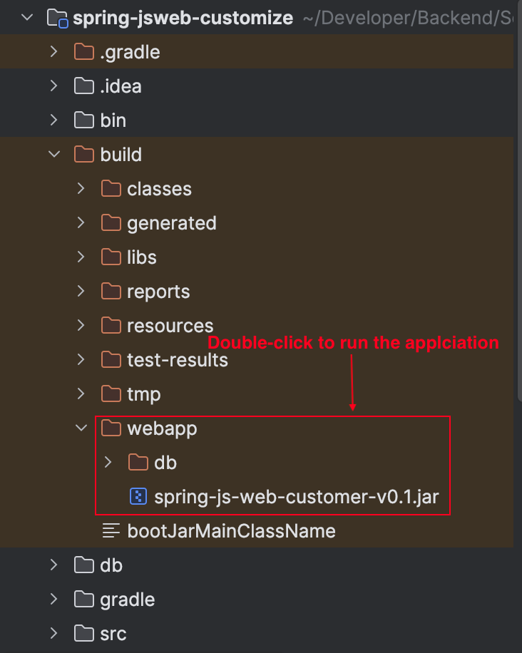
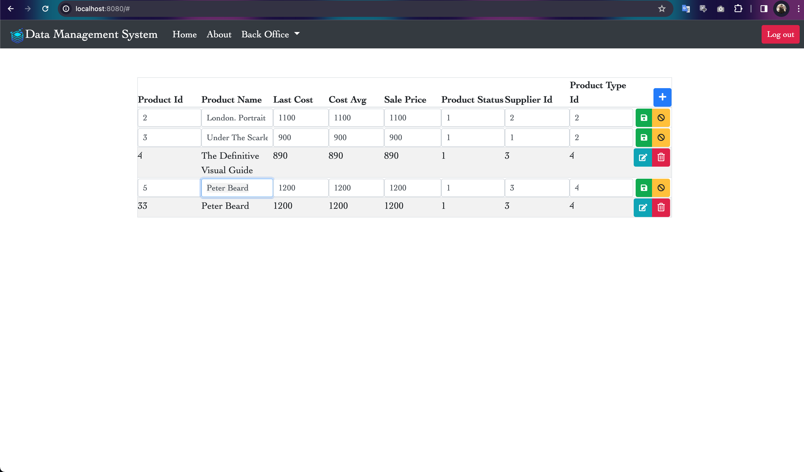
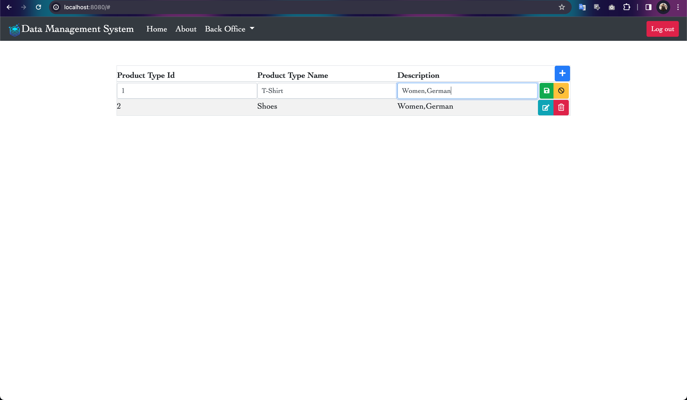

# Run and package the application
To run the application, run the following command in a terminal window
```
./gradlew bootRun 
```

Open your browser and go to : http://localhost:8080/

### Package the application
To package the application, follow these steps by running each individual command:
```
./gradlew clean
./gradlew build

```
You will see a folder `build/webapp/` containing a `db` folder and `spring-js-web-customer.jar`.
You can double-click `spring-js-web-customer.jar` to run the application, then open your browser and go to http://localhost:8080/"






